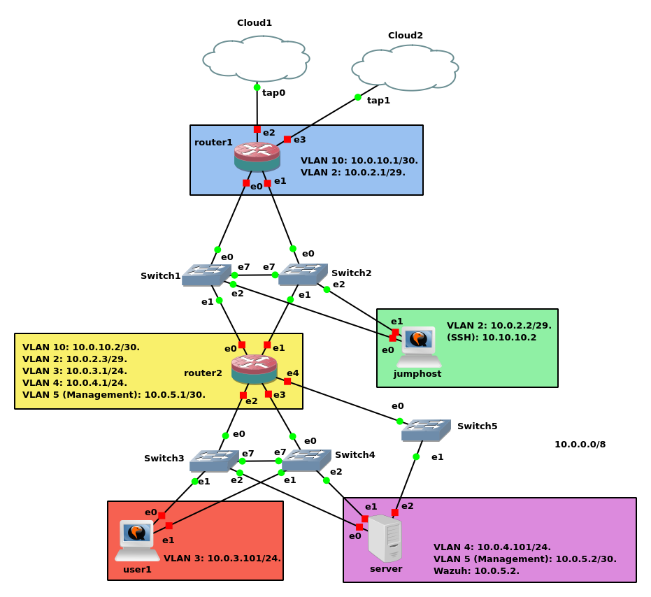

# gns3_network_security_lab
Secure Enterprise Network Infrastructure Lab. A highly available network architecture built in GNS3 (QEMU / AlmaLinux). The project demonstrates the elimination of Single Points of Failure (SPOF) via Link Aggregation, strict Network Segmentation using Firewalld, OS Security Hardening, and centralized threat monitoring via Wazuh SIEM.

# Architecture and Technical Implementation of a Resilient Network Infrastructure

This project demonstrates the construction of a fault-tolerant corporate network eliminating single points of failure (SPOF) , featuring strict traffic segmentation and an isolated management plane. The topology is implemented in the GNS3 emulation environment using QEMU virtualization. Instead of proprietary routers, a Software-Defined Networking (SDN) approach is utilized based on the AlmaLinux OS, allowing the management of all network layers via the Linux kernel.

## 1. Physical Layer and High Availability (L1/L2)

To ensure continuous operation (High Availability), the fundamental element of the topology is the duplication of physical connections.

- **Redundancy (Bonding):** Link aggregation (Bonding) according to the IEEE 802.1AX standard is configured on all key nodes.
    
- **Active-Backup Mode:** Given the limitations of GNS3 virtual switches regarding LACP support, `Mode 1: Active-Backup` is utilized. Only one interface transmits traffic; in the event of a link failure, the OS kernel automatically switches traffic to the standby port and sends a `Gratuitous ARP` to update the switching tables.
    
- **Inter-Switch Link (ISL):** For correct traffic failover between two independent switches, an ISL port connection is configured, ensuring the integrity of the broadcast domain.
    
**Table x.x. Physical connection map in the GNS3 environment**

| Device | Interface | Connected to | Port |
| :--- | :--- | :--- | :--- |
| Router1 | ens0 | Switch1 | e0 |
| | ens1 | Switch2 | e0 |
| Router2 | ens0 | Switch1 | e1 |
| | ens1 | Switch2 | e1 |
| | ens2 | Switch3 | e0 |
| | ens3 | Switch4 | e0 |
| | ens4 | Switch5 | e0 |
| Jumphost1 | ens0 | Switch1 | e2 |
| | ens1 | Switch2 | e2 |
| User1 | ens0 | Switch3 | e1 |
| | ens1 | Switch4 | e1 |
| Server1 | ens0 | Switch3 | e2 |
| | ens1 | Switch4 | e2 |
| | ens2 | Switch5 | e1 |
| Switch Connect | Switch1 e7 | Switch2 | e7 |
| Switch Connect | Switch3 e7 | Switch4 | e7 |

## 2. Logical Segmentation (VLAN - 802.1Q)

A flat network creates security risks and generates excessive broadcast traffic. Therefore, the infrastructure is divided into isolated domains using VLANs. Frame tagging is implemented via software at the OS virtual sub-interface level.

The following logical segments are created:

- **VLAN 10 (Transit):** A `/30` transit network for communication between routers (Router1 and Router2).
    
- **VLAN 2 (DMZ):** A zone for publicly accessible services and the intermediate access node (Jump Host).
    
- **VLAN 3 (Users) & VLAN 4 (Servers):** Internal production segments for workstations and application servers.
    
- **Out-of-Band (OOB) Management:** A separate physical network (VLAN 5) dedicated exclusively to administrative access. It is not routed to the Internet and is connected to a dedicated switch, guaranteeing access to equipment even during critical loads in the production network.
    

## 3. Routing and Addressing (L3)

The project utilizes a hierarchical routing model with two circuits:

- **External Circuit (Router 1):** Acts as an edge gateway. It provides Network Address Translation (Source NAT / Masquerade) for Internet access and contains Port Forwarding rules to the DMZ.
    
- **Internal Circuit (Router 2):** Responsible for Inter-VLAN routing between user and server networks, forwarding unknown traffic to the edge router.
    
- **Policy-Based Routing (PBR):** A conceptually critical element for nodes connected simultaneously to the production network and the OOB network. To prevent asymmetric routing (where a reply to management traffic attempts to exit via the default production gateway), PBR is implemented on the servers. A separate routing table and `ip rules` are created to ensure that traffic originating from the Management interface returns exclusively through the Management gateway.
    
**Table x.x. IP addressing plan and security zone configuration for key network nodes**

| Device    | Logical Interface | VLAN ID | IP Address / CIDR | Zone (Firewalld) |
| :-------- | :---------------- | :------ | :---------------- | :--------------- |
| Router1   | bond0.10          | 10      | 10.0.10.1/30      | routers          |
|           | bond0.2           | 2       | 10.0.2.1/29       | dmz              |
|           | ens2              | -       | 172.16.2.x/30     | external         |
| jumphost1 | bond0.2           | 2       | 10.0.2.2/29       | dmz              |
| Router2   | bond0.10          | 10      | 10.0.10.2/30      | routers          |
|           | bond0.2           | 2       | 10.0.2.3/29       | dmz              |
|           | bond1.3           | 3       | 10.0.3.1/24       | user             |
|           | bond1.4           | 4       | 10.0.4.1/24       | server           |
|           | ens4              | 5       | 10.0.5.1/24       | mgmt             |
| Server1   | bond0             | 4       | 10.0.4.101/24     | server           |
| User1     | bond0             | 3       | 10.0.3.101/24     | user             |

## 4. Access Control and Security Perimeter

Security is implemented following the principles of attack surface reduction and Defense in Depth.

- **Firewalld Zones:** Traffic is strictly controlled by binding interfaces to trust zones (`external`, `dmz`, `routers`, `management`, `users`, `servers`). Inter-zone communication is denied by default.
    
- **Rich Rules:** Inter-zone traffic is selectively allowed. For example, access to the management network is permitted exclusively from the Jump Host's IP address to the SSH port.
    
- **Jump Host (Bastion):** The only allowed path for remote infrastructure management. Direct access to servers or routers is not possible. Management is performed in a cascade manner using `ProxyJump` with SSH cryptographic keys. Password authentication and direct root access are completely disabled.

---

## JUMPHOST (Bastion Host)

A Jumphost is a specialized intermediary node (Bastion Host) located in an isolated DMZ (VLAN 2). It serves as the single secure entry point for infrastructure administration.

    Purpose: Secure remote infrastructure administration, attack surface minimization (disabling password authentication, allowing access only via SSH keys), and strict traffic segmentation.

    External Access Mechanism: Access to the Jumphost from the Internet is established through the external router (Router1). When a user connects to the external interface of Router1 on a non-standard port (port 17777), configured Firewall and NAT (DNAT) rules redirect this traffic to the Jumphost. The Jumphost, in turn, communicates with Router2, which uses Policy-Based Routing (PBR) rules to forward the traffic to Server1 via an out-of-band management (mgmt) link on VLAN 5.
    
### 🔀 Logical Network Segmentation and Traffic Routing (Traffic Flow & Segmentation)

One of the key objectives of this project is to guarantee security and fault tolerance through strict traffic segmentation. To prevent unauthorized lateral movement of threats within the network, the infrastructure is divided into isolated logical zones (VLANs), and access control is implemented using the concepts of least privilege and defense in depth. 

The diagram above illustrates three independent traffic flows, which are logically separated:

⚫ **Black arrows — Administrator Traffic (Logically Segmented Management & Jump Host)**
Administrator traffic is strictly separated from general user data flows. In accordance with security best practices, direct internet access to internal servers is prohibited.
* **Path:** The administrator connects exclusively through a specialized intermediary node — a Jumphost (Bastion Host) located in the Demilitarized Zone (DMZ). From there, traffic is routed to the internal management server, which has access to the logically isolated management network (Management VLAN).
* **Technology:** Utilizes exclusively SSH authentication via asymmetric RSA/Ed25519 keys (passwordless) and automated cascaded tunnel forwarding via the `ProxyJump` option.
* **Goal:** Implementation of logical separation between the management plane and the data plane (In-Band management with strict VLAN isolation). While sharing physical infrastructure, this strict logical segmentation ensures administrators maintain secure, dedicated access channels, significantly reducing the risk of interference from standard user traffic and protecting management interfaces from unauthorized access.

🔴 **Red arrows — Server Traffic (Server Zone - VLAN 4)**
Internal production servers are located in their own isolated segment (VLAN 4).
* **Path:** Access to the servers is routed through the central core of the internal network — Router 2 (via the aggregated interface `bond1.4`).
* **Goal:** The servers reside in a trusted internal zone of the Firewalld firewall, allowing them to communicate freely with each other and databases while protecting them from direct exposure to external networks and users. This minimizes the "blast radius" in the event of a potential security breach.

🟠 **Orange arrows — User Traffic (User Zone - VLAN 3)**
Standard user traffic is generated on workstations and moves within its dedicated network segment (VLAN 3).
* **Path:** The flow originates from the user and reaches Router 2, which acts as the default gateway (via `bond1.3`). If a user requires internet access, Router 2 forwards this traffic through the transit network (VLAN 10) to the external Router 1, where Network Address Translation (NAT/Masquerading) occurs.
* **Goal:** Isolating the user segment solves two problems simultaneously. First, security: users do not have direct access to servers and management equipment. Second, performance: reducing the size of the broadcast domain ensures that "noise" from user devices does not burden the processors of servers and network equipment.
